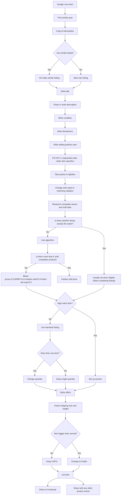

```mermaid
flowchart TD
    A[Google Lens item] --> B[Find similar post]
    B --> C[Copy AI description]
    C --> D{Use similar listing?}
    D -->|Yes| E[Hit make similar listing]
    D -->|No| F[Start new listing]
    E --> G[Write title]
    F --> G
    G --> H[Paste or write description]
    H --> I[Write condition]
    I --> J[Write disclaimers]
    J --> K[Write selling policies note]
    K --> L[Fill UPC in sequential order under item specifics]
    L --> M[Take photos in lightbox]
    M --> N[Change store type to matching category]
    N --> O[Research competitor prices and sold data]
    O --> P[Is there another listing exactly the same?]
	P --> |Yes| Q[Usually set price slightly below competing listings]
	P --> |No| R[Use algorithm]
	R --> S[Is there more than 5 sold competitor products]
	S --> |Yes| T[median sold price]
	S --> |No| U[Blend prices:0.5⋅MSRP×0.4+median sold×0.3+other-site avg×0.3]
    U --> V{High value item?}
    Q --> V
    V -->|Yes| W[Set up auction]
    V -->|No| X[Use standard listing]
    X --> Y{More than one item?}
    Y -->|Yes| Z[Change quantity]
    Y -->|No| AA[Keep single quantity]
    Z --> AB[Allow offers]
    AA --> AB
    W --> AB
    AB --> AC[Check shipping size and weight]
    AC --> AD{Item bigger than normal?}
    AD -->|No| AE[Keep USPS]
    AD -->|Yes| AF[Change to FedEx]
    AE --> AG[List item]
    AF --> AG
    AG --> AH[Share to Facebook]
    AG --> AI[Share with any other product owner]
```

